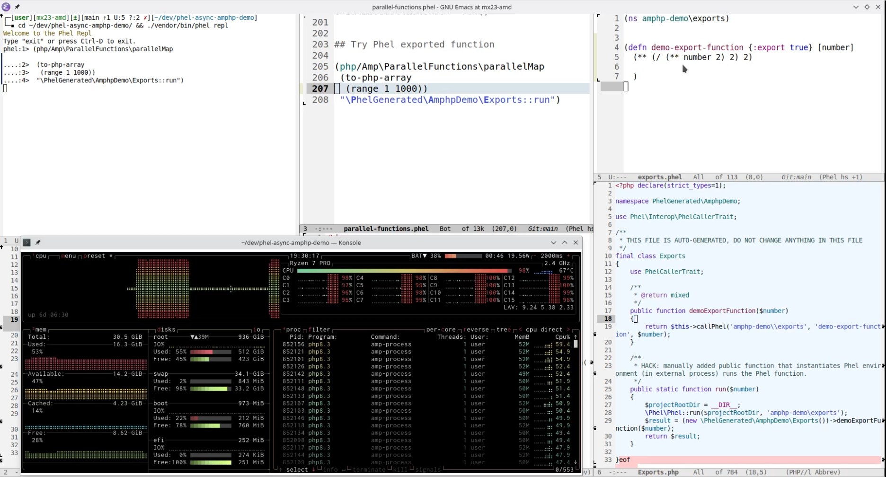

# PHP Fibers & AMPHP testing with [Phel](https://phel-lang.org/)

Testing concurrent programming with [PHP 8.1+ Fibers](https://wiki.php.net/rfc/fibers) and async libraries available via [AMPHP](https://amphp.org/) by translating some of the examples to Phel code.

Related discussion in Phel repo where comments are welcome https://github.com/phel-lang/phel-lang/discussions/793.

## Working examples

Tested on:

- PHP 8.2.7 (Debian 12)
- Phel v0.16.1 (dev-main)

Repository is created from https://github.com/phel-lang/cli-skeleton/ template which has more in-depth info on how to run Phel.

### AMPHP docs Hello World
- https://amphp.org/installation
```
composer install
vendor/bin/phel run src/helloworld.phel
# => Hello World from the future!%
```

### `amphp/socket` library
- https://amphp.org/socket
#### `echo-server.php`
- https://github.com/amphp/socket/blob/8833f66ff40afa8bbbe508c17336c646f084e85e/examples/echo-server.php

```
vendor/bin/phel run src/socket/echo-server.phel
```

After startup, connect by running `nc localhost 8888`, then type something to send message and see it echoed back.

#### `simple-http-server.php`
- https://github.com/amphp/socket/blob/8833f66ff40afa8bbbe508c17336c646f084e85e/examples/simple-http-server.php
```
vendor/bin/phel run src/socket/simple-http-server.phel
```

After startup, open http://127.0.0.1:8888 with web browser or: `curl -vvv http://127.0.0.1:8888`

### `amphp/http-server-router` `hello-world.php`
More complete HTTP server example with routing, argument parsing, logging etc.

- https://github.com/amphp/http-server-router/blob/c0434ad6b1a0899f1fba5371e991974e77df1140/examples/hello-world.php
- https://amphp.org/http-server-router

```
vendor/bin/phel run src/http-server-router/hello-world.phel
```

Starts server at http://localhost:1337 (demo route with argument http://localhost:1337/myname ).

- Does not work in Phel REPL as stdout logger makes it exit.
- How are webservers with Clojure(Script) set up to work with REPL that allow redefining functions or live reloading on the fly?
  - Research notes at https://github.com/phel-lang/phel-lang/discussions/794
  - Something about AMPHP HTTP server cluster hotreloading: https://amphp.org/cluster#hot-reload-in-intellij--phpstorm

### `amphp/http-server` `event-source.php`
Example with server-sent event stream connection (SSE).
Client keeps half-duplex HTTP connection open to server which pushes updates to client.
- https://github.com/amphp/http-server/blob/3.x/examples/event-source.php

```
vendor/bin/phel run src/http-server/event-source.phel
```

- Open in browser: http://0.0.0.0:1337/


### `amphp/parallel-functions` parallel processing
https://github.com/amphp/parallel-functions/

This library includes Clojure `pmap` style function that works with [SerializableClosure](https://github.com/laravel/serializable-closure/tree/2.x) communicated to thread pool process.

Getting it working from Phel seems tricky however, with diagnostics info in `src/parallel-functions.phel`. Best attempt (in the end) was exporting a Phel function so that it can be called as a public static method initializing Phel environment and calling the function that way. This succeeds with the computation and prints result value in REPL window but then exits the REPL (these libraries warn about REPL incompatibility and many things).

The exported function is at `src/exports/exports.phel` and it's generated class file at `src/PhelGenerated/Exports.php` which has been hand modified to have a public static function that the `/Amp\ParallelFunctions\parallelMap` is able to receive as argument and execute.



## TODO
### Channels (amphp/sync)
- https://github.com/amphp/sync?tab=readme-ov-file#channels
How to represent such code with Phel?
```
[$left, $right] = createChannelPair();

$future1 = async(function () use ($left): void {
    echo "Coroutine 1 started\n";
    delay(1); // Delay to simulate I/O.
    $left->send(42);
    $received = $left->receive();
    echo "Received ", $received, " in coroutine 1\n";
});
```
### Pipeline / ConcurrentIterator (amphp/pipeline)
- https://github.com/amphp/sync?tab=readme-ov-file#approach-4-concurrentiterator
- https://github.com/amphp/pipeline

Original template repo readme continues...
