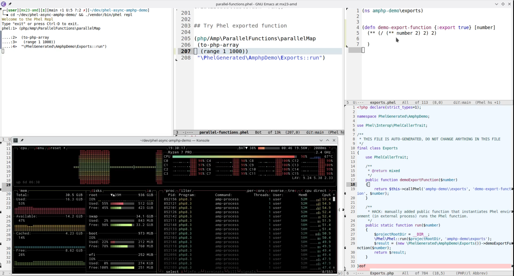

# [AMPHP](https://amphp.org/) examples for Phel

Phel bundles AMPHP since [0.32.0](https://github.com/phel-lang/phel-lang/releases/tag/v0.32.0) (2026/04), providing Clojure and ClojureScript inspired single-thread concurrency API's on top of PHP's built-in lower level [fibers](https://www.php.net/manual/en/language.fibers.php).

See [the later section](#amphp-library-interop-notes) for more details.

# Examples

## Requirements

- PHP 8.4+ (tested on PHP 8.4.16 / Debian 13) with `pcntl` module
- [Composer](https://getcomposer.org/download/)

Phel version is pinned in `composer.json`.

Some examples depend on `pcntl` PHP module for handling POSIX signals and it's not available on Windows (WSL recommended).

Alternatively examples can be run using inside container (`podman` command can be replaced with `docker`):

```bash
podman build -t phel-amphp-examples -f Containerfile .
podman run -it --rm -v .:/examples -p 8889:8889 -e=EXPOSE=true phel-amphp-examples /bin/bash
# podman rmi phel-amphp-examples  # cleanup image afterwards (optional)
```

## AMPHP docs Hello World
- https://amphp.org/installation
```
composer install
vendor/bin/phel run src/helloworld.phel

;; Hello World from the future!
;; ^:async Hello World from the future!
```

## `amphp/socket` library
- https://amphp.org/socket
### `echo-server.php`
- https://github.com/amphp/socket/blob/8833f66ff40afa8bbbe508c17336c646f084e85e/examples/echo-server.php

```
vendor/bin/phel run src/socket/echo-server.phel
```

After startup, connect by running `nc localhost 8889`, then type something to send message and see it echoed back.

### `simple-http-server.php`
- https://github.com/amphp/socket/blob/8833f66ff40afa8bbbe508c17336c646f084e85e/examples/simple-http-server.php
```
vendor/bin/phel run src/socket/simple-http-server.phel
```

After startup, open http://127.0.0.1:8889 with web browser or: `curl -vvv http://127.0.0.1:8888`

## `amphp/http-server-router` `hello-world.php`
More complete HTTP server example with routing, argument parsing, logging etc.

- https://github.com/amphp/http-server-router/blob/c0434ad6b1a0899f1fba5371e991974e77df1140/examples/hello-world.php
- https://amphp.org/http-server-router

```
vendor/bin/phel run src/http-server-router/hello-world.phel
```

Starts server at http://localhost:8889 (demo route with argument http://localhost:8889/myname ).

- Does not work in Phel REPL as stdout logger makes it exit.
- How are webservers with Clojure(Script) set up to work with REPL that allow redefining functions or live reloading on the fly?
  - Research notes at https://github.com/phel-lang/phel-lang/discussions/794
  - Something about AMPHP HTTP server cluster hotreloading: https://amphp.org/cluster#hot-reload-in-intellij--phpstorm

## `amphp/http-server` `event-source.php`
Example with server-sent event stream connection (SSE).
Client keeps half-duplex HTTP connection open to server which pushes updates to client.
- https://github.com/amphp/http-server/blob/3.x/examples/event-source.php

```
vendor/bin/phel run src/http-server/event-source.phel
```

- Open in browser: http://0.0.0.0:8889/

## WIP Examples

### TODO Channels (amphp/sync)
- https://github.com/amphp/sync?tab=readme-ov-file#channels
```
[$left, $right] = createChannelPair();

$future1 = async(function () use ($left): void {
    echo "Coroutine 1 started\n";
    delay(1); // Delay to simulate I/O.
    $left->send(42);
    $received = $left->receive();
    echo "Received ", $received, " in coroutine 1\n";
});
```
### Pipeline / ConcurrentIterator (amphp/pipeline)
- https://github.com/amphp/sync?tab=readme-ov-file#approach-4-concurrentiterator
- https://github.com/amphp/pipeline

### `amphp/parallel-functions` parallel processing
https://github.com/amphp/parallel-functions/

This library includes Clojure `pmap` style function that works with [SerializableClosure](https://github.com/laravel/serializable-closure/tree/2.x) communicated to thread pool process.

NOTE: This is not the same as single-threaded `pmap` that has been implemented in [`phel\async`](https://github.com/phel-lang/phel-lang/blob/522380ac6dfe1e336f075fe7519782e277543311/src/phel/async.phel#L83) after this experiment in https://github.com/phel-lang/phel-lang/pull/1272.

Getting it working from Phel seems tricky however, with diagnostics info in `src/parallel-functions.phel`. Best attempt (in the end) was exporting a Phel function so that it can be called as a public static method initializing Phel environment and calling the function that way. This succeeds with the computation and prints result value in REPL window but then exits the REPL (these libraries warn about REPL incompatibility and many things).

The exported function is at `src/exports/exports.phel` and it's generated class file (was) at `src/PhelGenerated/Exports.php` which was hand modified to have a public static function that the `/Amp\ParallelFunctions\parallelMap` is able to receive as argument and execute (I lost the actual file somewhere, use screenshot as reference).



## AMPHP library interop notes

List PHP's 'user' definitions to see which \Amp functions are available for interop from https://github.com/amphp/amp/blob/7cf7fef3d667bfe4b2560bc87e67d5387a7bcde9/src/functions.php

```
(get (php/get_defined_functions) "user")
;; => <PHP-Array ["amp\\async", "amp\\now", "amp\\delay", "amp\\trapsignal", ...
```

Phel wraps async in core.phel and delay in async.phel. The tutorial functions can be referred in following way (case-insensitive):

| AMPHP function | Direct interop (case-insensitive) | Phel wrapping    |
|----------------|-----------------------------------|------------------|
| Amp\async      | php/Amp\async                     | async            |
| Amp\delay      | php/Amp\delay                     | phel.async/delay |

Phel's `await` calls the `Amp\Future`'s `await` method.

Additionally `^:async` can be used as function definition metadata for wrapping the function automatically with `async` (since https://github.com/phel-lang/phel-lang/pull/1929).

Converting `Phel\Lang\AbstractFn` into `\Closure` used to be required
prior https://github.com/phel-lang/phel-lang/pull/1270 before passing
it to `Amp\async`:

```
(def my-closure1 (->closure my-function1))  ; does (\Closure/fromCallable my-function1)
(def future1 (async my-closure1))  ; does (php/Amp\async my-closure1)
```

This happens transparently to user since https://github.com/phel-lang/phel-lang/pull/1270.
